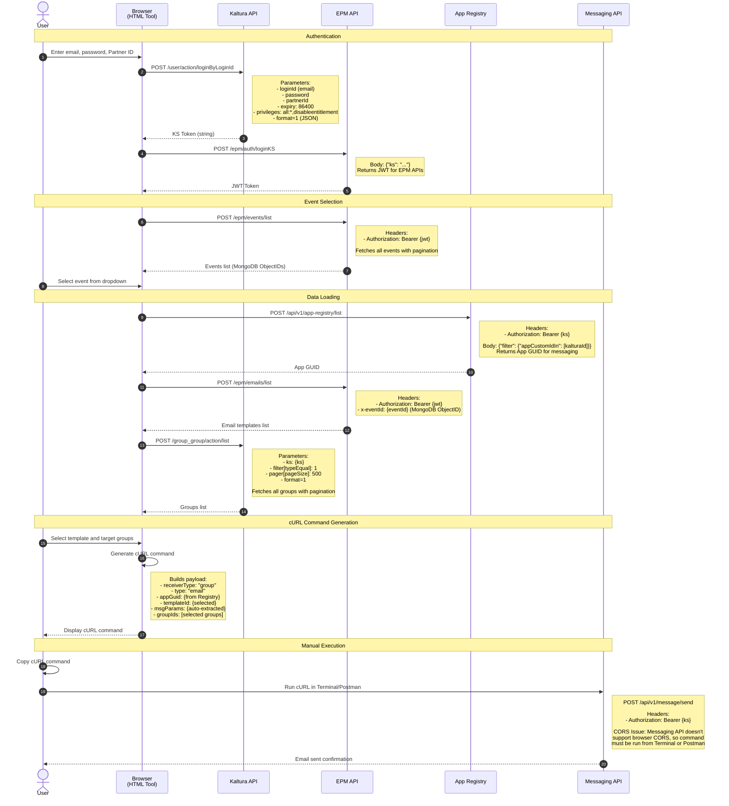

# CONNECT 2026 - Email Sender Tool
https://kaltura.atlassian.net/wiki/x/qQO3ewE

Internal operations tool for sending emails to groups using Kaltura's messaging system.

## Purpose

Allow site operations teams to authenticate, select an event, choose email templates, target specific groups, and send emails through Kaltura's messaging API.

## Features

- **cURL Command Generation**: Generates ready-to-use cURL commands (no backend required)
- **Authentication**: Login with Kaltura credentials to generate KS and JWT tokens
- **Event Selection**: Browse and select from available events
- **Template Selection**: Choose from event-specific email templates
- **Group Targeting**: Select one or multiple recipient groups
- **VPN-Ready**: Works with FortiClient VPN for internal API access

## How It Works

## Usage

### Quick Start

1. **Open the tool**: Upload `email-sender.html` to a web server and access via URL
2. **Enter credentials**:
   - Partner ID (e.g., `YOUR_PARTNER_ID`)
   - Email
   - Password
3. **Select event**: Choose from your available events
4. **Select template**: Pick an email template for the event
5. **Select groups**: Choose one or more recipient groups (hold Ctrl/Cmd for multiple)
6. **Generate command**: Click "Generate Command" to create the cURL command
7. **Run command**: Copy and paste into Terminal or import into Postman

### Prerequisites

- **FortiClient VPN** must be connected for internal API access
- Valid Kaltura account credentials
- Terminal or Postman for running cURL commands

## Files

### email-sender.html
Complete standalone HTML tool with embedded JavaScript. No backend required.

Features:
- Authentication with Kaltura API
- Event, template, and group selection
- Automatic token management (KS and JWT)
- cURL command generation with full payload

### send-email-proxy.php (Optional)
PHP proxy for bypassing CORS restrictions if you want to send emails directly from the browser instead of using cURL commands.

Usage:
- Upload to PHP server
- Update `email-sender.html` to use the proxy endpoint
- Emails will send directly from browser

## API Endpoints Used

### Kaltura Public APIs (KS Token)
- **Login**: `POST https://www.kaltura.com/api_v3/service/user/action/loginByLoginId`
- **Groups List**: `POST https://www.kaltura.com/api_v3/service/group_group/action/list`

### EPM APIs (JWT Token)
- **JWT Generation**: `POST https://epm.nvp1.ovp.kaltura.com/epm/auth/loginKS`
- **List Events**: `POST https://epm.nvp1.ovp.kaltura.com/epm/events/list`
- **List Email Templates**: `POST https://epm.nvp1.ovp.kaltura.com/epm/emails/list`

### App Registry API (KS Token)
- **Get App GUID**: `POST https://app-registry.nvp1.ovp.kaltura.com/api/v1/app-registry/list`

### Messaging API (KS Token)
- **Send Email**: `POST https://messaging.nvp1.ovp.kaltura.com/api/v1/message/send`

## Technical Details

### Two Event ID Types
- **Kaltura Event ID**: Integer (e.g., `2661602`) - used with Public APIs
- **EPM Event ID**: MongoDB ObjectID (e.g., `"69ca488af53a75439124f3a9"`) - used with x-eventId header

### Authentication Tokens
- **KS Token**: Generated from email/password, used for Kaltura Public APIs and Messaging API
- **JWT Token**: Generated from KS, used for EPM Internal APIs

### CORS Limitation
The Messaging API does not support CORS for browser requests. This is why the tool generates cURL commands instead of sending directly.

**Solutions**:
1. Run cURL commands in Terminal (current approach)
2. Use `send-email-proxy.php` to proxy requests from browser to Messaging API

## Security Notes

- Never commit credentials or tokens to version control
- Use environment variables for sensitive configuration
- KS tokens expire after 24 hours (configurable)
- JWT tokens expire based on EPM settings

## License

Internal Kaltura tool - not for public distribution
